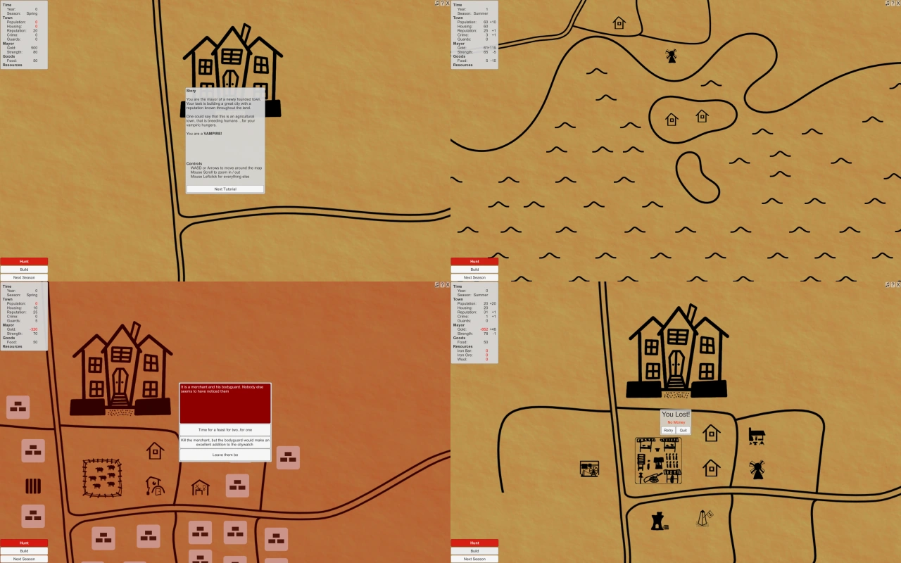

# Vampshire - Ludum Dare 33

In this game you take the role of a vampire mayor (why go running after food when you can invite it to live next-door?)
Build your own All-You-Can-Eat Vampire-restaurant... I mean peaceful countryside town.
You will have to manage money, resources, reputation and your own hunger.

My entry to the 33:rd Ludum Dare game jam (theme: You are the Monster), following the compo rules (alone, from scratch, 48 hours). This game was rated #64 in mood, #89 in innovation, and #128 overall (out of 1198 compo entries).

[Download the game here](https://github.com/Aggrathon/LudumDare33/releases) or [check out the Ludum Dare entry](http://ludumdare.com/compo/ludum-dare-33/?action=preview&uid=37874) (dead link)!

## Tips

In the top-right corner you will find a mute-button, a help-button and an exit-button.  
Trade can be used to bring in missing resources (the UI is a bit wonky, but works),

## Software Used

Unity, Gimp, Inkscape, Audacity, and Bosca Ceoil.

## Screenshots

